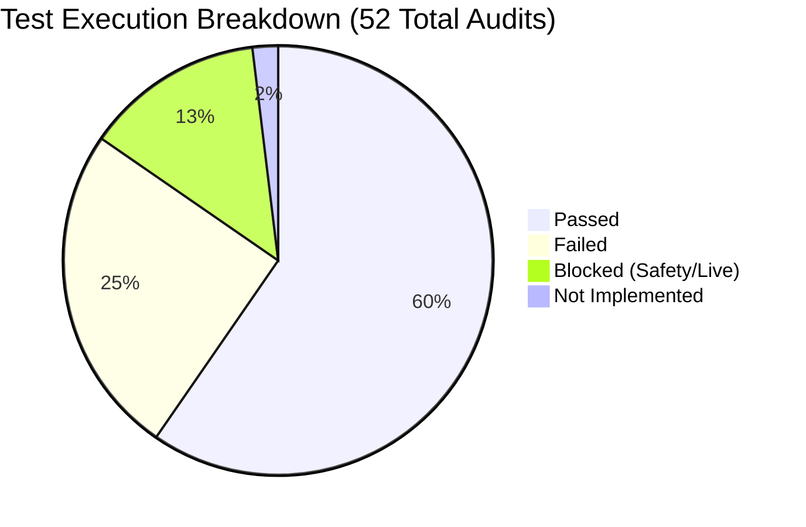

# Executive Summary: LeakGrader Senior QA Audit & Architecture Review

**Date**: September 7, 2026  
**Auditor**: Senior QA Engineer  
**Scope**: Full Platform Audit across 9 Phases (Architecture, Public UX, Scanner, LeadPulse, BookFlow AI Closer, OmniBrain RAG, ContentCrew SEO, Payment Gateway, Contact Engine)  
**Safety Protocol**: 100% Strict Read-Only & Non-Destructive Mode Enforced  

---

## 1. High-Level Metrics & Test Results

- **Total Tests Evaluated**: 52
- **Passed**: 31 (59.6%)
- **Failed**: 13 (25.0%)
- **Blocked (Safety/Live Gateway)**: 7 (13.5%)
- **Not Implemented**: 1 (1.9% — counted as Defect/Fail per instructions)
- **Total Defect Count (Failed + Not Implemented)**: **14**

---

## 2. Severity Breakdown of Identified Bugs

| Severity Level | Count | Definition | Primary Impact |
| :--- | :---: | :--- | :--- |
| 🔴 **CRITICAL** | **5** | Authentication bypass, tenant data exposure, unauthenticated wipe, open paid APIs | Immediate security & data privacy compliance liability |
| 🟠 **HIGH** | **4** | 40x formula discrepancy, JSON concurrency lost updates, legal mismatch, missing auth/billing | Financial mistrust, commercial leakage, data race conditions |
| 🟡 **MEDIUM** | **4** | Missing 404 page, contact spam risk, synthetic prospect labeling, self-competitor battle | Degraded user experience, spam vulnerability |
| 🟢 **LOW** | **1** | Estimate vs exact wording in UI dial | Minor copywriting ambiguity |

---

## 3. Top Five Recommended Fixes (Priority Remediation)

### 1. 🔒 Secure the Founder / Admin Dashboard (`/founder`)
* **Bug ID**: `BUG-01` (CRITICAL)
* **Risk**: The founder command center, live analytics, and pipeline ledger are publicly exposed to any visitor without a password.
* **Fix**: Add a session-based or token-authenticated middleware in `app.py` before serving `/founder`, `/dashboard`, or `/analytics`.

### 2. 📐 Harmonize Public Formula with Backend Implementation
* **Bug ID**: `BUG-06` (HIGH)
* **Risk**: The publicly displayed methodology formula on the homepage shows `Traffic × 8% × 68.4% × 72% × Deal Value` ($1,181,952/mo for 25k visitors / $1.2k deal), but the backend multiplies by an undisclosed `2.5%` close-rate factor, producing `$29,500/mo` (a **40x discrepancy**).
* **Fix**: Update the methodology card in `web/index.html` to include the `2.5% Conservative Deal Close Rate` factor so executive math matches the scorecard output.

### 3. 🛡️ Implement Server-Side Entitlement & License Validation
* **Bug ID**: `BUG-02` (CRITICAL)
* **Risk**: Core paid capabilities (Apollo-grade prospect generation, SEO article factory, knowledge RAG) can be accessed freely by any script sending raw POST requests to `/api/leads/generate` and `/api/content/generate`.
* **Fix**: Enforce an `Authorization: Bearer <license_token>` check on all non-free endpoints, validated against verified Lemon Squeezy subscriptions.

### 4. 🏢 Enforce Multi-Tenant Data Isolation in Document Vault
* **Bug ID**: `BUG-03` & `BUG-04` (CRITICAL)
* **Risk**: OmniBrain uses a single global in-memory index (`ALL_DOCUMENTS` / `ALL_CHUNKS`). One user can query or delete (`/api/documents/clear`) documents uploaded by another user.
* **Fix**: Scope document storage, vector chunks, and search queries by an authenticated `tenant_id` / `workspace_id`. Restrict `/api/documents/clear` to authorized workspace owners.

### 5. ⚡ Add File-Locking & Atomic Writes for JSON Storage Concurrency
* **Bug ID**: `BUG-08` (HIGH)
* **Risk**: Multi-threaded server threads write simultaneously to `leads_vault.json`, `appointments.json`, and `knowledge_index.json` using raw `open(..., 'w')`, risking partial writes and lost updates.
* **Fix**: Implement thread-safe mutex locks (`threading.Lock()`) and atomic write-replace (`tempfile` + `os.replace`) to prevent database corruption under concurrent requests.

---

## Deliverables Generated in Repository
- 📄 Comprehensive Report: [`omnibrain/qa/FEATURE_TEST_REPORT_2026-09-07.md`](file:///c:/Users/Administrator/Downloads/mastermind/omnibrain/qa/FEATURE_TEST_REPORT_2026-09-07.md)
- 📊 Structured Bug Tracker: [`omnibrain/qa/BUGS_2026-09-07.csv`](file:///c:/Users/Administrator/Downloads/mastermind/omnibrain/qa/BUGS_2026-09-07.csv)
- 📁 Evidence Artifacts: [`omnibrain/qa/evidence/`](file:///c:/Users/Administrator/Downloads/mastermind/omnibrain/qa/evidence/)
- 📋 Executive Summary Document: [`omnibrain/qa/EXECUTIVE_SUMMARY_2026-09-07.md`](file:///c:/Users/Administrator/Downloads/mastermind/omnibrain/qa/EXECUTIVE_SUMMARY_2026-09-07.md)
