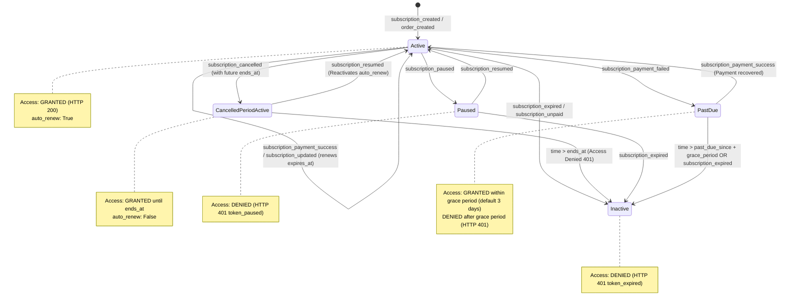

# Sprint 0.7: Lemon Squeezy Subscription Lifecycle Architecture

**Date**: September 9, 2026  
**Component**: `engine/security_guard.py` & Webhook Processing Gateway  
**Standard**: Lemon Squeezy Webhooks v1 & SaaS Billing Lifecycle Specification  

---

## 1. Overview & Problem Definition

In typical SaaS subscription lifecycles, when a customer cancels their subscription mid-billing cycle, their access must remain active until the end of the paid period (`ends_at`). Premature revocation results in customer disputes, chargebacks, and violates terms of service.

Prior to Sprint 0.7, receipt of `subscription_cancelled` immediately set token status to inactive. In Sprint 0.7, the subscription lifecycle was redesigned as a state machine that handles cancellations, expirations, pauses, resumes, and payment failures with an automated grace period.

---

## 2. Mermaid State Transition Diagram



---

## 3. Lifecycle States & Access Policies

| State | Internal Record Flags | API Access | HTTP Code / Reason | Description |
|---|---|:---:|:---:|---|
| **Active** | `status: "active"`, `auto_renew: True`, `expires_at > now` | **ALLOWED** | 200 OK | Customer has an active, renewing subscription. Full access to entitlements. |
| **Cancelled (Grace/Current Period)** | `status: "active"`, `auto_renew: False`, `cancelled_at: ts`, `expires_at: ends_at` | **ALLOWED** | 200 OK | Customer cancelled recurring billing, but the current billing cycle has not finished. Access maintained until `expires_at`. |
| **Cancelled (Expired Period)** | `expires_at <= now` | **DENIED** | 401 Unauthorized (`token_expired`) | Billing period ended after cancellation. Access terminated. |
| **Paused** | `status: "paused"`, `paused_at: ts` | **DENIED** | 401 Unauthorized (`token_paused`) | Subscription is paused by user/merchant. Paused tokens cannot execute paid queries. |
| **Resumed** | `status: "active"`, `paused_at: None`, `expires_at: extended` | **ALLOWED** | 200 OK | Customer resumed subscription. Status restored to active. |
| **Past Due (Within Grace Period)** | `status: "past_due"`, `past_due_since: ts` (< 3 days ago) | **ALLOWED** | 200 OK | Automated renewal failed. Grace period allows dunning emails to resolve payment without immediate disruption. |
| **Past Due (Grace Period Expired)** | `status: "past_due"`, `past_due_since: ts` (>= 3 days ago) | **DENIED** | 401 Unauthorized (`payment_grace_period_expired`) | Grace period elapsed without successful payment. Access locked. |
| **Inactive / Expired** | `status: "inactive"` | **DENIED** | 401 Unauthorized (`token_expired`) | Explicit expiration or unpaid termination. |

---

## 4. Webhook Handling Architecture

### 4.1 ISO 8601 Timestamp Normalization
Lemon Squeezy payloads convey date timestamps as ISO 8601 strings (e.g. `2026-10-09T14:30:00.000000Z`).
The helper `_parse_iso_timestamp` parses ISO format strings, stringified floats, and numerical timestamps into standard epoch floats:
```python
def _parse_iso_timestamp(val) -> Optional[float]:
    if not val:
        return None
    if isinstance(val, (int, float)):
        return float(val)
    if isinstance(val, str):
        # Support ISO 8601 strings
        iso_str = val.replace("Z", "+00:00")
        try:
            dt = datetime.datetime.fromisoformat(iso_str)
            return dt.timestamp()
        except Exception:
            pass
        try:
            return float(val)
        except Exception:
            return None
    return None
```

### 4.2 Webhook Idempotency Scoping
In earlier revisions, the event deduplication key defaulted to `data.get("id")` (the subscription ID). Consequently, sending a subsequent lifecycle event (e.g., `subscription_cancelled`) for the same subscription was incorrectly flagged as a duplicate of `subscription_created`.
The event key is now scoped to include the event name:
```python
event_id = (
    meta.get("custom_data", {}).get("event_id") 
    or f"{event_name}_{order_or_sub_id}"
)
```
This guarantees that each unique lifecycle transition event is processed once and only once, while preventing replayed duplicate deliveries.
