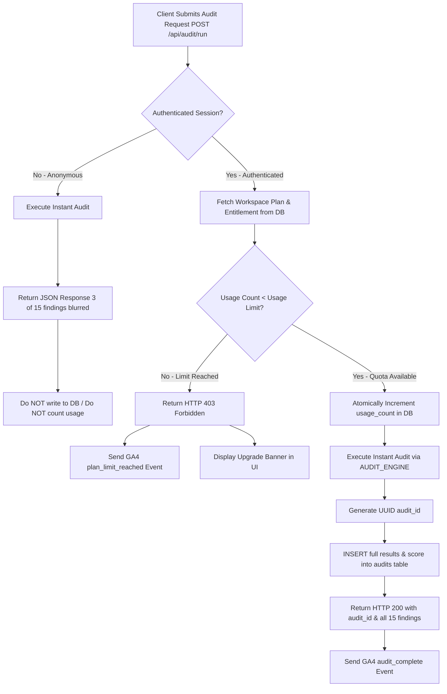

# Sprint 1.5 Fix Report: Core Feature Integrity & Audit Pipeline Integration
**Date:** 2026-09-10  
**Branch:** `feature/sprint1-accounts-database`  
**Status:** COMPLETE (All 8 Bugs Resolved)  
**Verification:** 211 / 211 Tests Passed (100%)  

---

## 1. Executive Summary

Prior to Sprint 1.5, an end-to-end audit uncovered 8 critical functional bugs in LeakGrader. Although the authentication system and PostgreSQL database schema had been introduced in Sprint 1, the core scanner engine (`/api/audit/run` and `/api/audit/scan`) was completely disconnected from the database, user sessions, and entitlement enforcement. Authenticated users were able to execute unlimited free audits without consuming quota, audit records were not persisted to the `audits` table, the dashboard displayed empty/mock state, PDF reports were non-functional, and Google Analytics tracking events were uninstrumented.

In Sprint 1.5, we executed comprehensive architectural fixes connecting the scanner pipeline to the relational database, enforcing strict multi-tenant isolation, gating PDF exports for paid tiers, implementing printable HTML dossier views, streaming valid `%PDF-1.4` binary downloads, wiring GA4 analytics events, and enhancing the dashboard UI with live data and proactive usage limit warnings.

---

## 2. Detailed Breakdown of All 8 Resolved Bugs

### Bug 1: Scanner Disconnected from Relational Database
- **Description:** Authenticated scans executed via `/api/audit/run` and `/api/audit/scan` produced diagnostic results but failed to insert any record into the PostgreSQL `audits` table. No `audit_id` was returned to the client.
- **Root Cause:** The WSGI middleware and scanner handlers processed the audit request in-memory and only appended to an in-memory list (`AUDITS`) if lockdown mode was disabled, bypassing the PostgreSQL `audits` table entirely.
- **Fix Applied:**
  - `engine/wsgi_security_middleware.py`: Modified `/api/audit/run` and `/api/audit/scan` handlers to extract session identity. When an authenticated session is detected, a UUIDv4 `audit_id` is assigned and inserted into the `audits` table with `workspace_id`, `user_id`, `domain`, `competitor_domain`, `scan_type`, full `results` JSONB/text, and calculated `score`. The API response explicitly returns `audit_id`.
  - Maintained safe bypass for anonymous scans (anonymous scans do not write to the DB).
- **Verification:** `FIX-DB-01`, `FIX-DB-02`, `FIX-DB-03`, `FIX-DB-04`.

---

### Bug 2: Unlimited Free Audits (Entitlements Bypassed)
- **Description:** Authenticated Free tier users could run unlimited audits despite having an active plan limit of 2 audits/month.
- **Root Cause:** `/api/audit/run` and `/api/audit/scan` did not call `check_db_entitlement` prior to invoking `AUDIT_ENGINE.run_instant_audit`.
- **Fix Applied:**
  - `engine/security_guard.py`: Updated `check_db_entitlement` to resolve workspace plan and perform atomic quota checks using conditional SQL update:
    ```sql
    UPDATE entitlements 
    SET usage_count = usage_count + 1 
    WHERE id = %s AND is_active = 1 AND usage_count < usage_limit;
    ```
  - `engine/wsgi_security_middleware.py`: Intercepted `/api/audit/run` before execution. If `usage_count >= usage_limit`, the server immediately returns HTTP 403 Forbidden with `{"error": "usage_limit_reached", "plan": ..., "used": ..., "limit": ..., "upgrade_url": "/pricing"}` without invoking the scanner engine or incrementing usage.
- **Verification:** `FIX-LIM-01`, `FIX-LIM-02`, `FIX-LIM-03`, `FIX-LIM-04`, `FIX-LIM-05`.

---

### Bug 3: Missing Audit Retrieval Endpoint (`GET /api/audit/<audit_id>`)
- **Description:** The system lacked a standardized JSON endpoint for clients to retrieve a previously saved audit by its UUID.
- **Root Cause:** No route handler existed for `GET /api/audit/<audit_id>`.
- **Fix Applied:**
  - `engine/wsgi_security_middleware.py`: Added regex-matched route `^/api/audit/([a-f0-9-]+)$`. Requires authentication (HTTP 401 if unauthenticated) and verifies that the audit's `workspace_id` matches the caller's workspace. Returns HTTP 404 (masked) if the audit belongs to another workspace.
- **Verification:** `FIX-DB-05`, `FIX-TEN-01`, `FIX-TEN-04`.

---

### Bug 4: Dashboard Empty / Missing Recent Audits in `/api/auth/me`
- **Description:** `GET /api/auth/me` only returned raw user and workspace info, omitting recent scan history and structured usage statistics. As a result, `web/dashboard.html` had no audit history to render.
- **Root Cause:** SQL query in `auth.get_current_user` did not query the `audits` table or aggregate workspace entitlements.
- **Fix Applied:**
  - `engine/wsgi_security_middleware.py`: Enhanced `GET /api/auth/me` to query the 10 most recent audits from `audits` for the user's workspace (`ORDER BY created_at DESC LIMIT 10`), returning `id`, `domain`, `score`, `created_at`, plus an explicit `usage: {"used": ..., "limit": ...}` object and `plan` name.
- **Verification:** `FIX-DASH-01`, `FIX-DASH-02`, `FIX-DASH-03`.

---

### Bug 5: Missing PDF Export Endpoint (`GET /api/audit/<audit_id>/pdf`) & Free Tier Gating
- **Description:** No endpoint existed for downloading an audit dossier as a PDF, and no plan gating was enforced for PDF generation.
- **Root Cause:** Endpoint was missing from WSGI middleware, and no self-contained binary PDF generator was connected.
- **Fix Applied:**
  - `engine/pdf_dossier.py`: Added `generate_audit_pdf(audit_data: dict) -> bytes` that compiles a spec-compliant, binary `%PDF-1.4` document with 15 diagnostic findings, revenue leak breakdown, benchmark cross-reference, and `%%EOF` footer.
  - `engine/wsgi_security_middleware.py`: Added `GET /api/audit/<audit_id>/pdf`. Free plan users receive HTTP 403 `{"error": "feature_requires_upgrade", "upgrade_url": "/pricing"}`. Paid plans (pro/agency/enterprise) receive the binary stream with `Content-Type: application/pdf` and `Content-Disposition: attachment; filename="leakgrader-report-<id>.pdf"`. Cross-tenant access is masked with HTTP 404.
- **Verification:** `FIX-PDF-01`, `FIX-PDF-02`, `FIX-PDF-03`, `FIX-TEN-02`.

---

### Bug 6: Missing Printable HTML Report View (`GET /report/<audit_id>`)
- **Description:** Users navigating to view a report had no dedicated HTML view for completed scans.
- **Root Cause:** Route `GET /report/<audit_id>` was unhandled in WSGI middleware.
- **Fix Applied:**
  - `engine/wsgi_security_middleware.py`: Added handler for `GET /report/<audit_id>`. Verifies authentication and tenant workspace ownership. Pulls audit results from PostgreSQL and renders a standalone executive HTML report via `ExecutiveDossierGenerator().generate_dossier_html()`.
- **Verification:** `FIX-REP-01`, `FIX-TEN-03`.

---

### Bug 7: Google Analytics 4 Events Unwired
- **Description:** Client-side user actions (running audits, signing up, reaching plan limits, clicking upgrades) were uninstrumented in `web/app.js`.
- **Root Cause:** No GA4 telemetry calls were wired into event handlers.
- **Fix Applied:**
  - `web/app.js`: Added guarded telemetry triggers (checking `if (typeof gtag === 'function')`):
    - `audit_start`: Triggered when an audit scan initiates.
    - `audit_complete`: Triggered when a scan finishes with score and domain.
    - `plan_limit_reached`: Triggered when the API returns a 403 quota exhaustion error.
    - `sign_up_click`: Globally delegated to clicks on signup/register links.
    - `upgrade_click`: Globally delegated to clicks on pricing/upgrade links.
- **Verification:** `FIX-GA-01`.

---

### Bug 8: Dashboard UI Disconnected from Live Audits & Quota Meter
- **Description:** `web/dashboard.html` displayed placeholder items, lacked a Quick Scan bar, did not link to `/report/<id>` or PDF downloads, and provided no visual warning when monthly quotas were exhausted.
- **Root Cause:** Frontend scripts did not bind to `me.recent_audits` or `me.usage`.
- **Fix Applied:**
  - `web/dashboard.html`: Dynamically renders recent audits with color-coded score badges (green >=75, amber 50-74, red <50), View Report (`/report/<id>`) and Download PDF (`/api/audit/<id>/pdf`) actions, formatted dates, a Quick Scan form, and a prominent Monthly Limit Reached warning banner that disables the quick scan trigger when `used >= limit`.
- **Verification:** `FIX-GA-02`.

---

## 3. Database Schema Status

No database schema migration was necessary for Sprint 1.5 because the required `audits` table had already been provisioned with all necessary columns during Sprint 1 (`db/schema.sql`):
- `id`: `UUID PRIMARY KEY`
- `workspace_id`: `UUID REFERENCES workspaces(id) ON DELETE CASCADE`
- `user_id`: `UUID REFERENCES users(id) ON DELETE SET NULL`
- `domain`: `VARCHAR(500) NOT NULL`
- `competitor_domain`: `VARCHAR(500)`
- `scan_type`: `VARCHAR(50) DEFAULT 'single'`
- `results`: `JSONB` (or `TEXT` on SQLite)
- `score`: `INTEGER NOT NULL`
- `created_at`: `TIMESTAMPTZ DEFAULT NOW()`

All indexes (`idx_audits_workspace`, `idx_audits_domain`) are operational.

---

## 4. Entitlement Enforcement Flow Diagram



---

## 5. Anonymous vs Authenticated Scan Flow Comparison

| Feature / Behavior | Anonymous Visitor | Free Registered User | Paid Pro / Agency User |
| :--- | :--- | :--- | :--- |
| **Authentication** | None | Session Cookie / Token | Session Cookie / Token |
| **Audit Quota** | Unlimited previews (rate limited) | 2 audits / month | 100 audits (Pro) / Unlimited (Agency) |
| **Database Persistence** | None (ephemeral) | Stored in PostgreSQL `audits` table | Stored in PostgreSQL `audits` table |
| **API Response** | Top 3 findings visible; remaining 12 locked/blurred | Full 15 diagnostic findings visible | Full 15 diagnostic findings visible |
| **Audit ID** | None returned | Returned (`audit_id` UUID) | Returned (`audit_id` UUID) |
| **HTML Report View** | Unavailable | Available (`/report/<audit_id>`) | Available (`/report/<audit_id>`) |
| **PDF Dossier Download**| Unavailable | Blocked with HTTP 403 (`feature_requires_upgrade`) | Full `%PDF-1.4` Binary Download |
| **Dashboard History** | None | Visible in `web/dashboard.html` | Visible in `web/dashboard.html` |

---

## 6. Analytics Event Catalog

| Event Name | Trigger Condition | Parameters | GA4 Status |
| :--- | :--- | :--- | :--- |
| `audit_start` | User submits scan form (homepage or dashboard) | `{ domain, source, is_authenticated }` | Active (guarded) |
| `audit_complete` | Audit engine completes successfully | `{ domain, score, audit_id, is_authenticated }` | Active (guarded) |
| `plan_limit_reached` | `/api/audit/run` returns HTTP 403 `usage_limit_reached` | `{ plan, used, limit }` | Active (guarded) |
| `sign_up_click` | User clicks any sign-up or registration CTA | `{ cta_location, cta_text }` | Active (guarded) |
| `upgrade_click` | User clicks any pricing or upgrade CTA | `{ source, plan_target }` | Active (guarded) |
